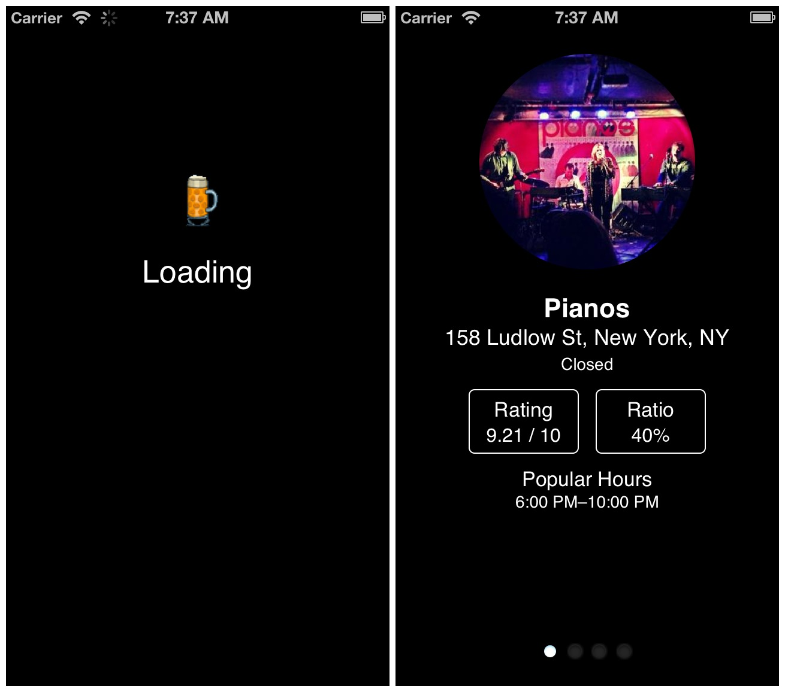

Bar Hop was made for fun and was intended to help plan a series of bars to go to. Since
it was built for guys, it also helped make sure that the girl to guy ratio was
in a guy's favor.

Bar Hop was made with [Jason Caetano](http://jasoncaetano.com) during HackNY's Spring 2013 hackathon using the Foursquare API. The source of the code and more information can be found on [GitHub](https://github.com/sjlu/bar-hop).

