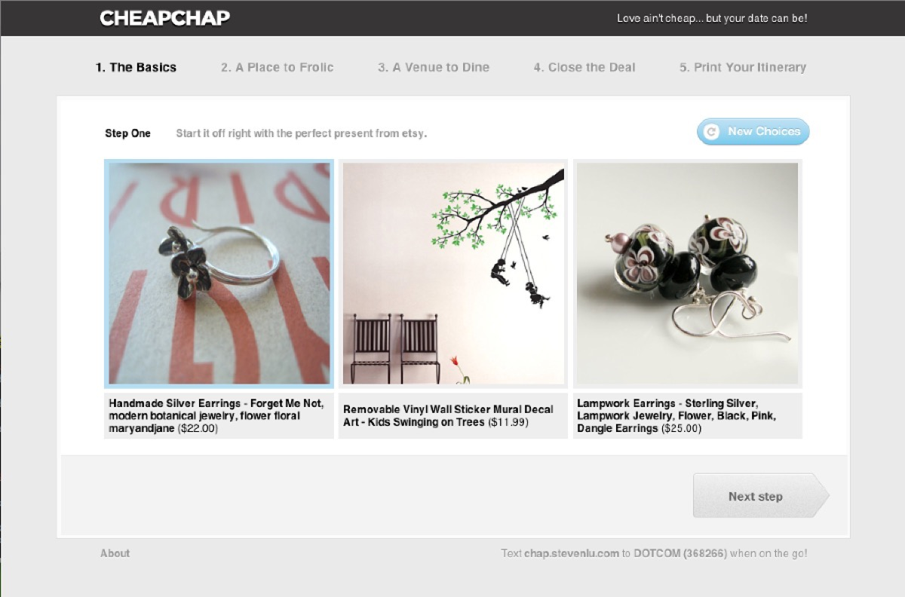
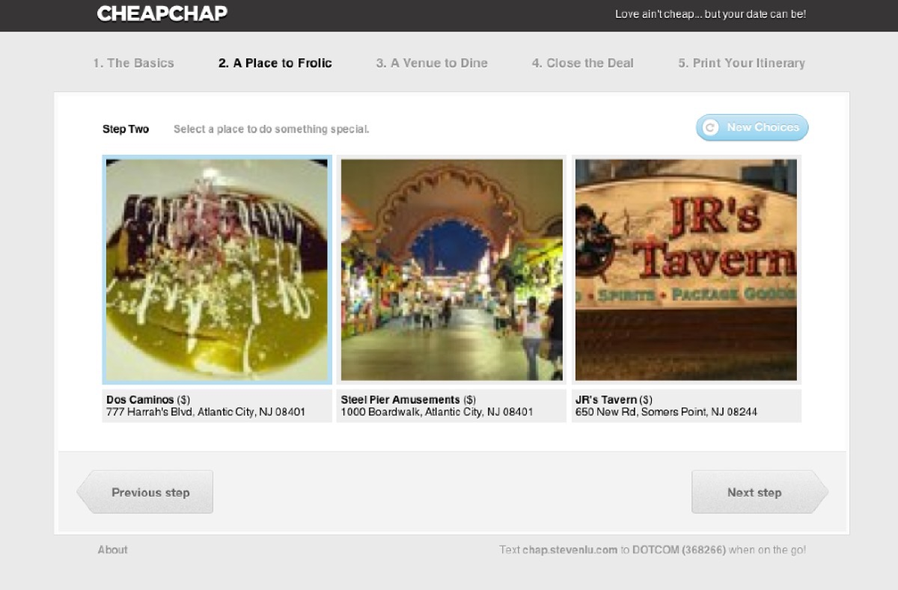
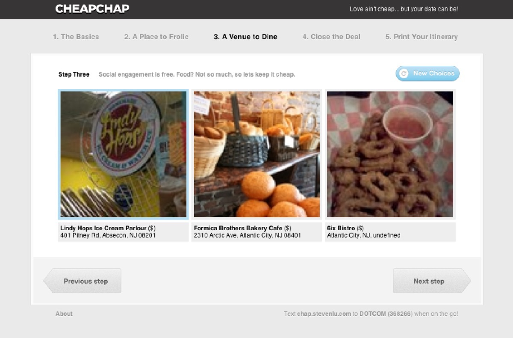
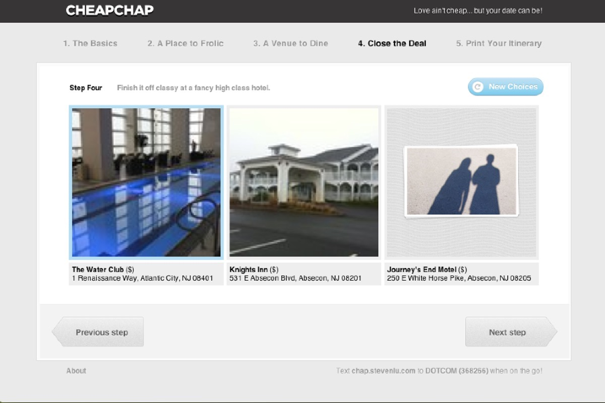
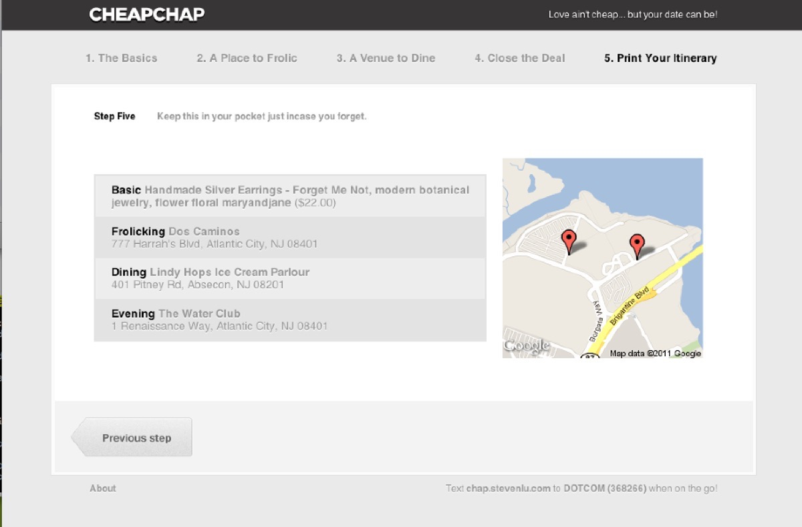

CheapChap was built at a hackathon in 2011 with [Wayne Sun](https://www.linkedin.com/in/uusunn),
[Jarek Sedlacek](http://jsedlacek.info/) and [Russell Frank](http://russfrank.us). CheapChap
found the cheapest possible date options in NYC from restaurants on Yelp to gifts on Etsy. The
catch phrase of CheapChap was "your date may not be happy, but your wallet will be!"

CheapChap finds cheap and affordable date solutions for you and your date. Your date may not be happy, but your wallet will be!

[View source](https://github.com/sjlu/hacknyf2011)

