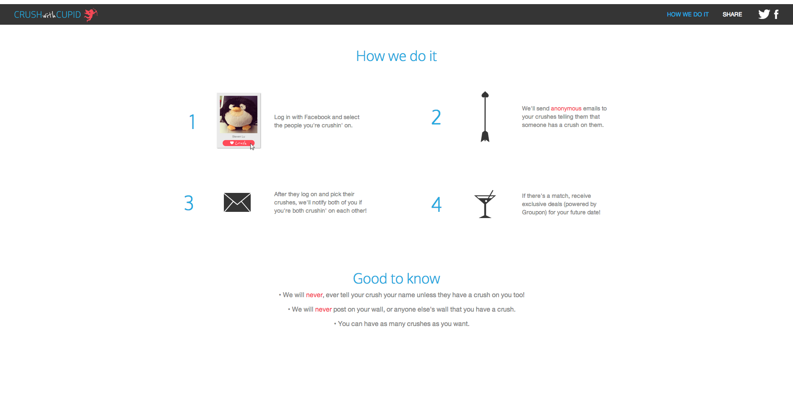
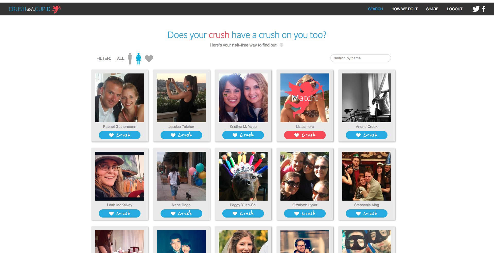

Crush With Cupid, built along with [Liz Jamora](http://lizjamora.com) and [Zach Myrow](http://zachmyrow.com/),
was a Facebook application that allowed friends to select who they have a crush on.
If a crush was mutually found between two people, they where immediately contacted about each other
with a special deal from LivingSocial or Groupon. If there is no match, they remain completely anonymous.

Crush with Cupid was built with .

[View source](https://github.com/sjlu/crush-with-cupid) \\
[Facebook](http://facebook.com/crushwithcupid) \\
[Twitter](http://twitter.com/crushwithcupid)

