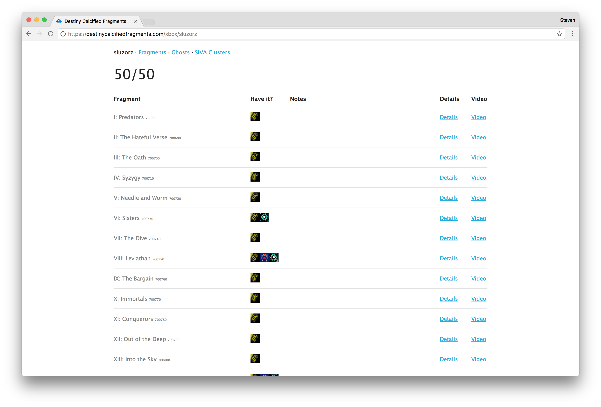

When Destiny's "The Taken King" came out, it introduced a new concept of calcified fragments.
They scattered 50 of these fragments throughout the game but rewarded you for obtaining
at least 45 of them.

These Destiny sites were inspired displaying which fragments you had and where you could
find them throughout the map by just inputting your gamertag. It also gave you a breakdown
of which characters also had them (since you had to collect 45 of them with 1 character).

At it's peak, these sites reached over 25 million gamers and is currently indexed on
Google as the top sites to finding in-game collectables.

[Destiny Calcified Fragments](https://destinycalcifiedfragments.com)

[Destiny SIVA Clusters](https://destinysivaclusters.com)

[Destiny Dead Ghosts](https://destinydeadghosts.com)

