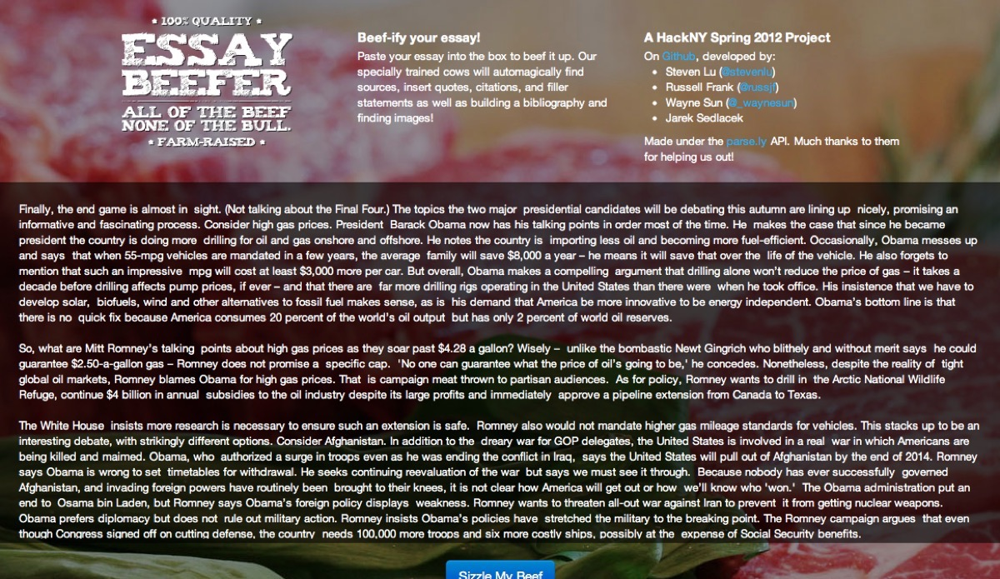
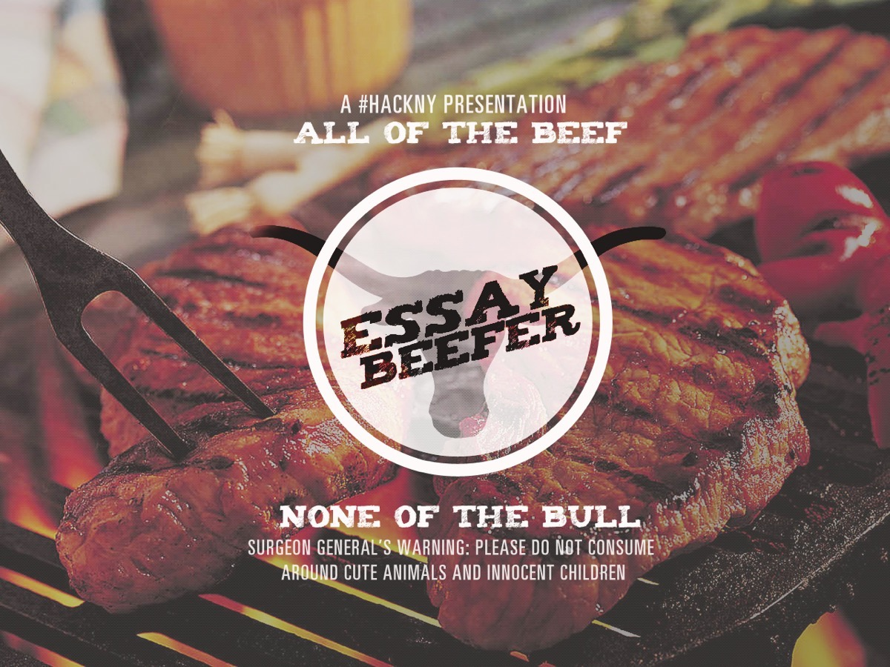

Essay Beefer takes your essays and makes it longer by placing approriate quotes and bibliographies into it.

This was developed during HackNY's Spring 2012 hackathon with [Jarek Sedlacek](http://jsedlacek.info/), [Russell Frank](http://russfrank.us)
and [Wayne Sun](https://www.linkedin.com/in/uusunn).

More information and source code can be found on [GitHub](https://github.com/sjlu/hacknys2012).

