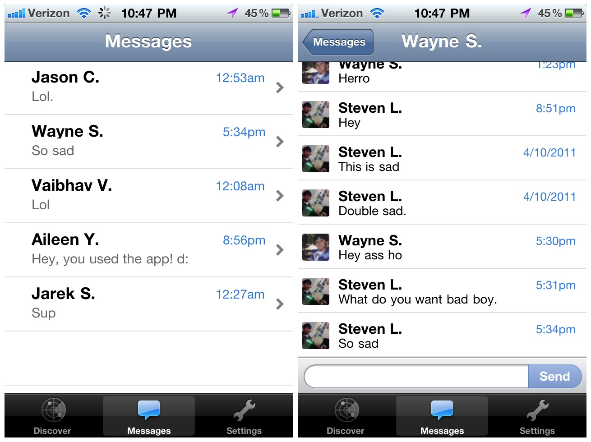
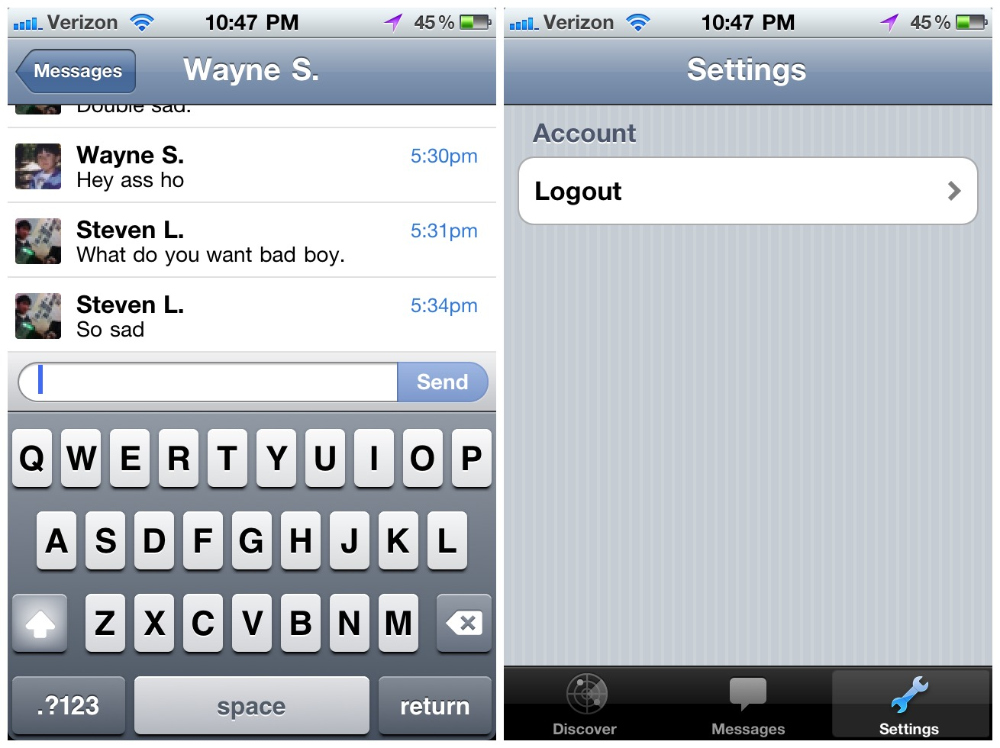

Keeno was a location based chat service where you could communicate with people with
similar attributes and that are around you. Built with [Jarek Sedlacek](http://jsedlacek.info/),
[Russell Frank](http://russfrank.us) and [Wayne Sun](https://www.linkedin.com/in/uusunn) at a
hackathon in 2010.

[View source](https://github.com/sjlu/Keeno)

