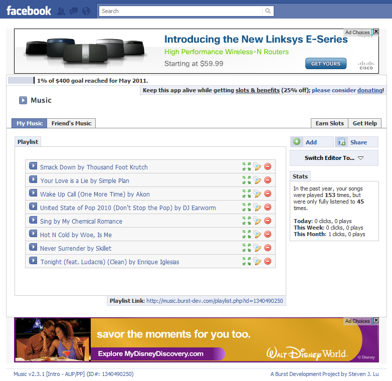

The Music App is probably one my most popular applications that I've built. In late 2006, Facebook
released its third party API and gave developers the ability to integrate with their platform. The
app was built to upload songs to Facebook profiles, just like MySpace had. I initially wanted to
make it for myself but decided to submit it Facebook's application directory. A few days later, it
was accepted as one of the first 100 applications and began growing at 10,000 users per hour.

Most of my enthusiasm for programming grew from this application as I had to adapt as the
application evolved. One of the first things I learned was scaling infrastructure to withstand
the unexpected growth rate that the application incurred during a time where Amazon's web services
did not exist.

Afterwards, I had to obtain some help building features and maintain the application, so I grabbed
help from [Russell Frank](http://russfrank.us) who helped me maintain the infrastructure and build
compatibility features.

Around 2009, the [RIAA](https://www.riaa.com/) informed me that I must abide to the
[DMCA](http://en.wikipedia.org/wiki/Digital_Millennium_Copyright_Act) in order to keep the
application running. Instead, I decided to shutdown the application to push a complete
overhaul.

Russ decided to leave during this point where I decided to keep it going. This is when I
had help from [Frances Soong](http://francessoong.com) and [Shy Ruparel](http://shyruparel.com)
to create a new and improved experience of the application.

Because Facebook changed its design, the application evolved to become a place for Indie artists
to publish and share their music on their Facebook pages. It even gave artists paid advertising
opportunities to obtain more "listens" of their music. It essentially became what is the modern day
SoundCloud.

After a while, the application became less and less useful as Facebook removed more and more of its
features that it relied on. At the end of life in 2011, the application had a peak of over 8 million
plays per month and had over 5,000 paying artists.

[View source](https://github.com/burstdev/fb-music-app)

