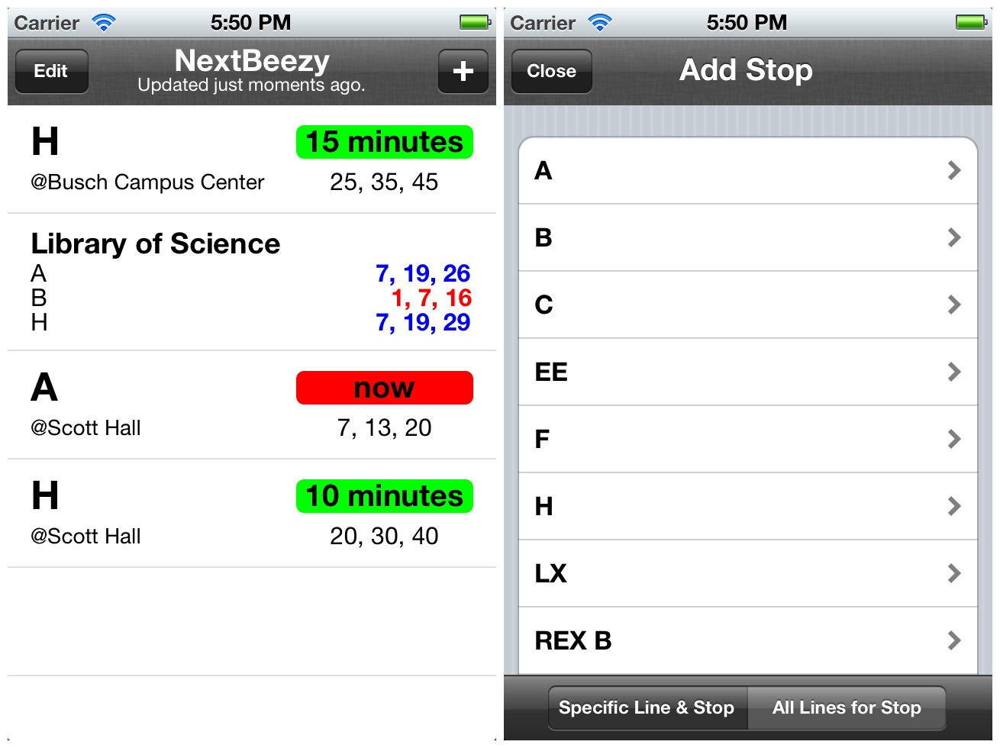
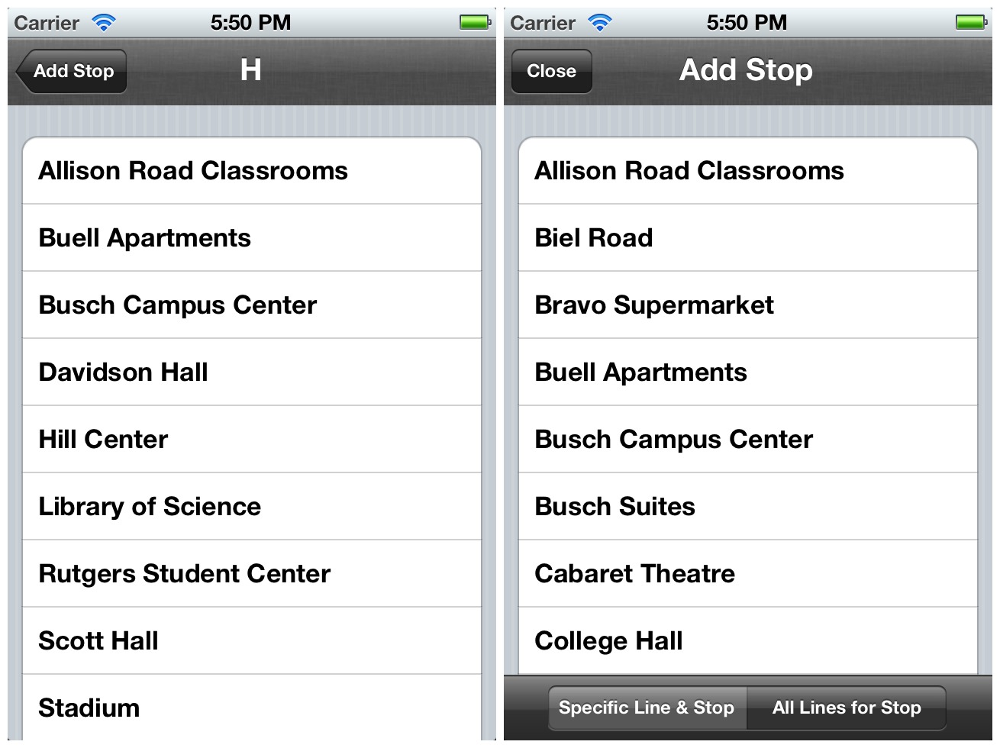

NextBeezy was built to help Rutgers students know when their bus is arriving to
the stations that they care about most. Because most students had a routine,
it was made to set and forget where you'd only see bus times that mattered to
you the most.

[App Store](http://itunes.apple.com/us/app/nextbeezy-rutgers/id518122298?ls=1&mt=8)

