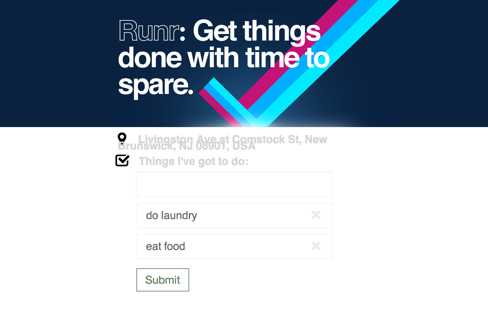
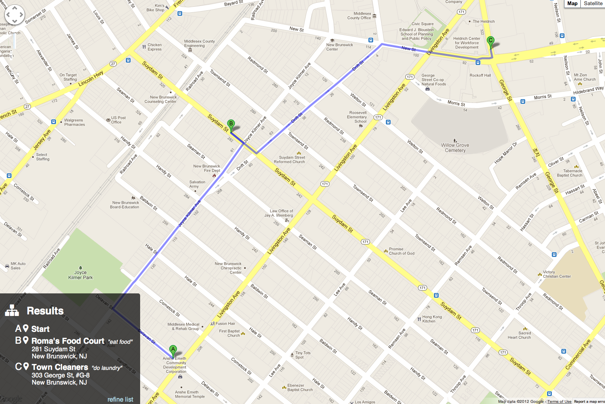

Runr was built during Facebook's "Summer of Hack 2012" hackathon in NYC. It was an attempt to solving
the traveling salesman problem which is not knowing what or how to do your tasks given the surrounding
area. Runr tried interpreting your tasks and found places to complete those tasks. Out of the given
suggestions, it tried to create the shortest path possible amongst them.

Runr was built along with [Russell Frank](http://russfrank.us)
and [Wayne Sun](https://www.linkedin.com/in/uusunn) and can be found on [GitHub](https://github.com/sjlu/runr).

