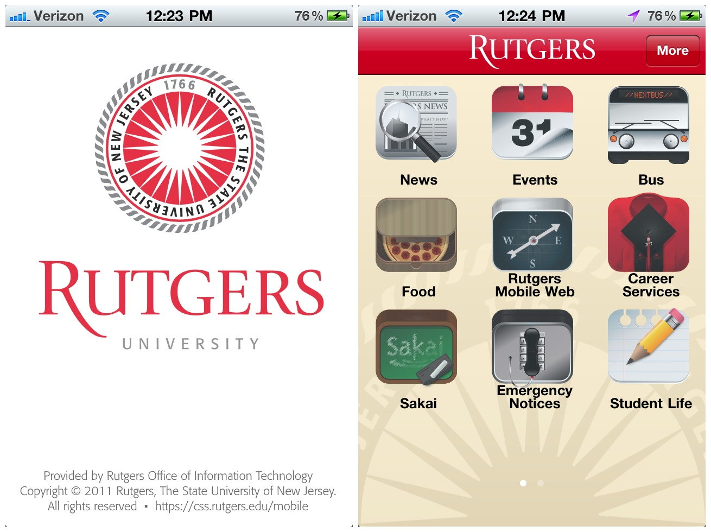
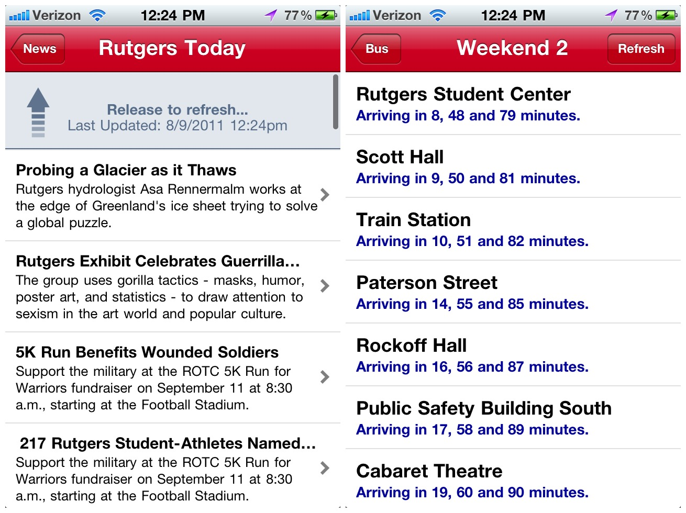
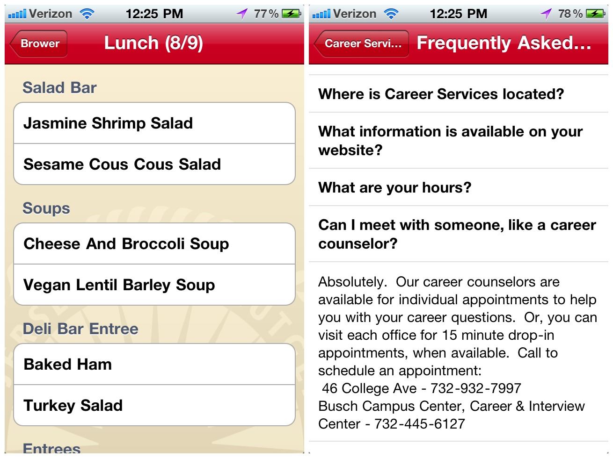

I prototyped the application when the idea was introduced to me at [OSS](http://oss.rutgers.edu/).
It brought needed information to students and faculty with a mobile device. It then later gained
traction and became Rutgers' offical mobile application.

[App Store](https://itunes.apple.com/us/app/rutgers-university/id494594693?ls=1&mt=8)

